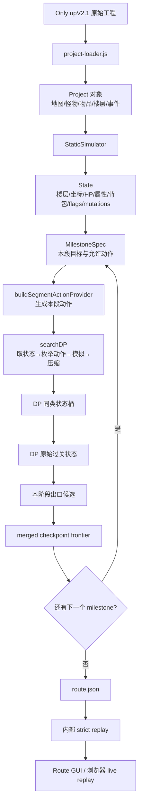

# Solver 架构（中文导览）

这份文档是项目负责人的入口。先记住一句话：

> 游戏原始工程提供数据和规则，`StaticSimulator` 精确执行动作，milestone 把长路线切成小段，segment DP 在每段内搜索并压缩状态，checkpoint 把少量候选交给下一段，最后用 strict replay 和浏览器 live replay 验证路线。

本项目的 canonical solver 是 `shared-solver/`。塔工程里的 `solver/` 是历史副本，不是新的算法入口。

## 1. 一张总图



每个方框对应的主要代码如下：

| 责任 | 入口 | 你应该把它理解成什么 |
|---|---|---|
| 读取游戏 | `shared-solver/lib/project-loader.js` | 把原始 `project/*.js` 读成普通 JS 对象 |
| 状态与模拟 | `shared-solver/lib/state.js`、`simulator.js` | 当前游戏局面和执行规则 |
| 目标定义 | `shared-solver/milestones/*.json`、`lib/milestone-spec.js` | “这一段什么时候算通过” |
| 动作生成 | `lib/segment-dp.js` 的 `buildSegmentActionProvider()` | 当前局面在本段允许做哪些事 |
| 核心搜索 | `lib/dp-search.js` 的 `searchDP()` | 从一个状态扩展出后继状态 |
| 分段调度 | `lib/segment-dp.js` 的 `runMilestoneGraph()` | 按 milestone 顺序传递候选 |
| 路线验证 | `lib/agenda-policy-evaluation.js`、`route-store.js` | 再执行路线并比较 exact state |
| 可视化 | `route-gui.js`、`gui/`、`lib/live-replay.js` | 看 timeline、单步 diff 和真实浏览器回放 |

## 2. Project、State、Action

### Project：规则和地图的只读资料

`loadProject()` 会读取：

- `data.js`：全局配置、楼层顺序、初始数据；
- `items.js`：物品、门、道具；
- `enemys.js`：怪物和战斗属性；
- `maps.js`：地图 tile 定义；
- `floors/*.js`：每层地图和事件。

它不是一局游戏，而是“这款游戏的规则手册”。

### State：某一时刻的完整局面

State 至少包括：

```text
floorId / hero.loc
hero.hp、atk、def、mdef、lv、exp、equipment
inventory / flags
visitedFloors
floorStates.removed / replaced
route / routeTrace
```

其中 `floorStates.removed/replaced` 很重要：它记录哪些怪、宝石、药水、门或机关已经改变。候选之间的长期差异通常藏在这里，而不是只藏在当前 HP。

### Action：一次可执行的决策

Action 可能是：

- 战斗：`battle:ghostSoldier@MT2:2,1`；
- 拾取、装备、开门、使用道具；
- `changeFloor` / `floorFly`；
- 某些事件动作。

一次 action 往往已经包含“走到目标前的 path”，所以搜索不是每走一格都产生一个完整搜索节点。`decision` 则是已经写入 route 文件、带有 pre/post snapshot 的记录动作。

## 3. Milestone 是什么

milestone 不是一个“推荐动作”，而是一道阶段验收条件。例如 `mt1-gate-1559` 会检查：

```text
floor = MT1
HP >= 1559
ATK >= 19
DEF >= 10
MDEF >= 130
EXP >= 5
并且能存活执行指定的 skeleton 战斗
```

`buildSegmentGoalPredicate()` 会把 milestone JSON 转成一个函数。需要区分两个事件：

```text
goal predicate matched：状态本身满足 milestone 的全部正式条件。
goalAccepted：状态满足 predicate，并且已经通过当前 DP retention，进入 goal archive。
```

当前代码没有单独的 `goalPredicateMatched` observer event。因此没有看到 `goalAccepted`，不能直接推出“从未生成过满足条件的 successor”；该 successor 也可能在进入 goal archive 前被 dominance 或容量规则拒绝。

milestone 还定义本段的 action policy、DP 配置、hard present/removed tiles，以及下一段的 `startFrom` 关系。当前 Only Up 的典型链条是：

```text
mt1-gate-1559
  → mt2-entry
  → mt2-local-3582
  → mt2-hp3834
```

`runMilestoneGraph()` 会把前一段的 merged candidates 当成后一段的输入。某段没有结果时，它可能进入 configured repair、retry-current 或 expanded-previous；因此报告里可能出现多个 phase，但这不是把目标条件放宽了。

## 4. DP 搜索实际做什么

一次 DP expansion 可以用下面的伪代码理解：

```text
从 agenda 取一个待展开 state
  ↓
action provider 枚举本段可做动作
  ↓
逐个 applyAction，得到 successor state
  ↓
检查动作是否被截断、是否越过 action policy
  ↓
为 successor 计算 DP key，定位生产搜索桶
  ↓
使用 dominanceConfig/default comparator 判断是否保留
  ↓
若已保留，再检查 goal predicate
  ↓
通过时加入 goal archive 并发出 goalAccepted；否则把 successor 放回 agenda
```

`best-first`、`FIFO`、`hybrid-fair-*` 主要改变 agenda 先取哪个状态；它们不改变游戏规则，也不应该被解释为不同的游戏模型。

## 5. DP key、dominance 与 exact state

项目中有三种容易混淆的 key：

### `buildStateKey()`：完整 exact identity

包含当前 HP、坐标、属性、背包、flags、visited floors 和 mutations。它回答：

> 两个状态在当前时刻是否完全一样？

### `buildDominanceKey()`：去掉 HP 的辅助身份

它把 HP 忽略，其他关键字段仍保留，主要用于路线记录、审计和状态对比。它可以帮助回答：

> 两个 exact state 除 HP 外是否具有相同结构？

它不是生产 segment DP 的正式桶身份，也不要理解成“先计算 dominance key，再按 HP 做所有搜索保留”。

### `buildDpStateKey()`：搜索用的抽象桶身份

它根据 `keyMode` 选择 location、region 或 mutation 等抽象方式，并保留攻防、等级、经验、背包、flags、visited floors、mutations 等字段。它的职责是控制搜索规模，不是给最终路线做法庭级别的相等证明。

因此要区分：

```text
DP key 相同        = 搜索认为属于同一个抽象桶
dominance key 相同 = exact state 去掉 HP 后的辅助同类身份
exact state key 相同 = 所有记录字段完全一致
```

生产 segment DP 的真实顺序是：

```text
buildDpStateKey()
  → 找到 DP bucket
  → 使用 dominanceConfig.compare 或默认 comparator
  → 决定候选是否留在 bucket / agenda
```

## 6. 四层候选筛选：不要再把它们都叫 skyline

“skyline”可以直译成“非劣前沿”：一个候选在某个维度更好、另一个候选在另一维度更好，就不能只留一个。当前代码实际有四层：

### 6.1 DP 同类状态桶（DP bucket skyline）

发生在 `searchDP()` 内。相同抽象 key 的状态放在同一桶里，由 `dpSkylineMax` 限制桶内最多保留多少个代表。它解决的是：

> 搜索过程中状态太多，哪些状态还值得继续展开？

`dominance-rejected` 表示新状态被已存在的同类状态压制；`skyline-capacity-rejected` 表示它可能有区别，但桶已满。

### 6.2 DP 原始过关状态（raw DP goal states）

仍然在一次 `searchDP()` 内。所有满足 milestone predicate 的状态先进入 goal archive，再按 `goalSkylineLimit` 和排序规则压缩。它回答：

> 这一次 attempt 找到的过关状态，哪些先从 DP 内部带出来？

### 6.3 本阶段出口候选（segment goal skyline）

`searchSegmentDP()` 会对 raw goal states 做出口筛选，主要角色包括：

```text
highest-hp / best-combat / highest-atk / highest-def
highest-mdef / highest-exp / shortest
best-target-margin / target-survivable
```

`preserveSkylineRoles=true` 时，每种角色先保住代表，再用剩余名额补足。`candidate-2` 带 `shortest`，表示“路线最短代表被保护”，不表示算法已经证明它的长期价值最高。

### 6.4 merged checkpoint frontier

一个 segment 可能从多个上游 candidate 分别启动。`runSegmentAgainstFrontier()` 收集所有 attempt 的出口候选，`mergeMilestoneFrontier()` 再合并和筛选。这个结果才是“下一 milestone 的入口候选池”。

所以 `candidateLimit` 控制的是跨候选合并后的阶段出口规模，和 `dpSkylineMax` 不是一回事。

## 7. Decision 3 的正确读法

审计 observer 如果只用 teacher 的 pre exact key 去匹配，会出现：

```text
teacher pre-state TA 被 dominance reject
production 保留了 continuation-compatible witness PB
PB 执行同一个 action
action 后得到 exact state S3
```

这时报告若写 `candidate-not-generated`，容易被理解成“搜索没有生成这步”。准确含义是：

> teacher 的原前置状态被等价 witness 替代；该 action 在 witness 上执行，并在 post-state exact rejoin。

判断这类剪枝是否安全，只看三件事：

1. 原状态是否确实被同类 witness 压制；
2. witness 是否能执行同一个 action；
3. action 后 exact state 是否重新相等。

## 8. 从搜索到 route replay

搜索得到 candidate 后，route store 会保存完整 decisions 和 snapshot。内部 strict replay 会：

1. 从 start snapshot 恢复 State；
2. 检查每步 pre exact state；
3. 解析并执行 recorded action；
4. 检查 post exact state；
5. 最终比较 route final state。

这证明的是“模拟器能够按记录重现路线”。它不是浏览器画面。浏览器 live replay 再把同一条 route 交给真实 H5 游戏页面，并逐步检查运行时状态。

## 9. 读审计报告的最短路径

看到一份报告时按下面顺序读：

```text
1. provenance.commitStable：报告是不是在同一份源码上开始/结束？
2. search diagnostics：frontier、stoppedReason、actionTrimmed、expansionBudgetExhausted？
3. runStatus：是 completed，还是 completed-with-search-failures？
4. ledger：每个 segment/phase 实际尝试了什么？
5. strictReplay：是 replay 失败，还是根本没有 route 文件？
6. memory：是否因为 heap/RSS stop？
7. gates：这是报告有效性检查，不是 milestone 本身。
```

以后每轮 review 还应明确写三句话：

```text
本轮改了哪段真实算法；
这些变量用中文分别代表什么；
可视化界面里应该看到什么。
```
